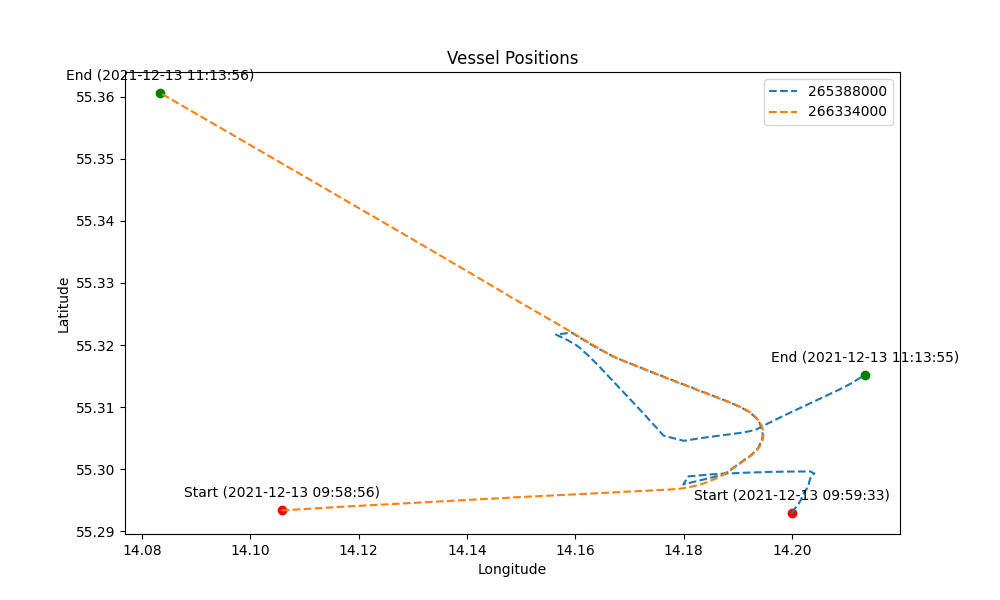

# Find vessel collision

## 1. preprocess_data.py

This script preprocesses the data from the AIS dataset. It reads the data from the AIS dataset and filters it down to the relevant 50km circle.

## 2. find_close_collisions.py

This script reads the preprocessed data and finds the close collisions between vessels. A close collision is considered to be when two vessels are within 30m of each other within 10 seconds.

## 3. find_closest.py

This script finds the closest collision from the close collisions found in the previous step. We find collision between MMSI 266334000 and MMSI 265388000 at 2021-12-13 10:43:56 (baltic sea incident).

## 4. visualize.py

This script visualizes the collision.

